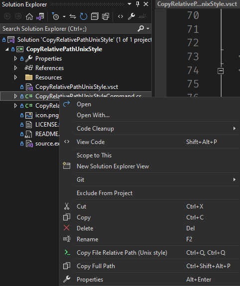
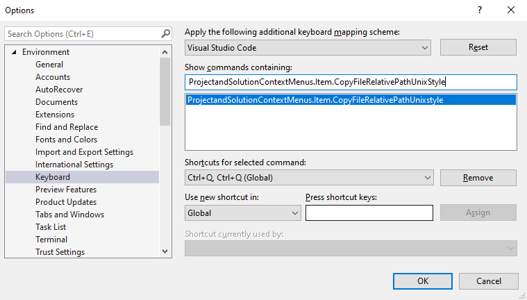

# A Visual Studio extension to copy a relative-to-solution unix-like file path in Visual Studio's solution explorer
A very simple extension for Visual Studio made out of frustration over a narrow case:

# Use Case
My workflow involves jumping over text editors (from VS to VSCode or to ST3). I need to copy a relative-to-solution unix-like file path so that I can quickly look for the same file in VSCode or ST3 using their "go to all" quick access panel.

VS doesn't have that functionality by default (there is another one that gives you the absolute path in windows format), and although I looked for extensions in their gallery, I couldn't find any (or one that for some reason didn't get installed), so I decided to create my own extension based on another project which I give credits down below.

# Usage

After installing this extension you will get a new option in the context menu when you right click on any file in the solution explorer as below:

You can also bind a keyboard shorcut by updating the associated command as shown below:

# Credits

The core logic of this extension is a slight modification of the answer provided in [this Stackoverflow post](https://stackoverflow.com/a/45180002/2528681). Thanks and lots of credits to the writer of the aforementioned post.

The primary logic for this extension is a modification of the solution provided by [Masoud Memariani](https://github.com/masoudmemariani) in their [CopyProjectUnixPath](https://github.com/masoudmemariani/CopyProjectUnixPath) repository. I would like to extend my sincere gratitude to Memariani for their contribution to the community.
